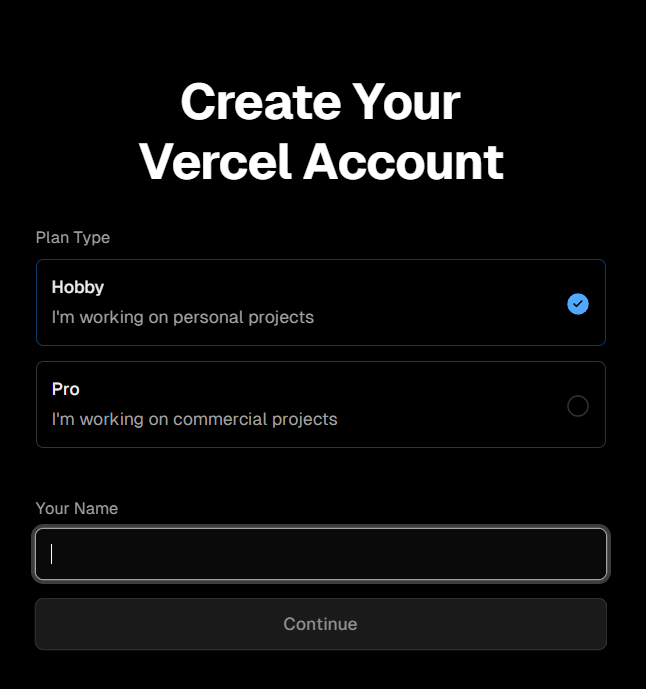
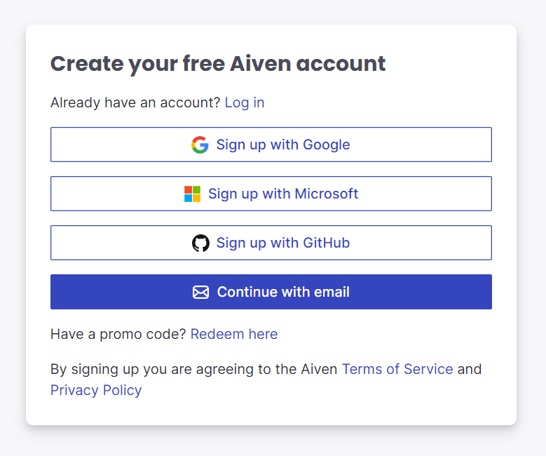
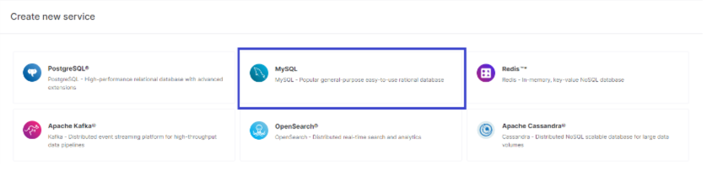

# How to Deploy

### You should start by creating accounts on Vercel and Aiven

- [Link to Vercel](https://vercel.com/login)
- [Link to Aiven](https://aiven.io)

### Vercel

**Click on sign up in the top right corner**


<br>

**Choose hobby and enter your name then continue**


<br>

**Continue with GitHub**


<br>

**Now you need to ensure you have a GitHub repo ready to deploy**

- First, you need to grant access to your GitHub again.
- Once you have a repo and have granted access, you should import the repo you want to deploy.
- Now, let's move on to *Aiven*.

### Aiven

**Click on Get started for free in the top right corner**


<br>

**Here, we can also continue with GitHub**


<br>

**Then, we want to choose MySQL**


<br>

**Next, select a Free plan**


<br>

**Now we have all the information to log in to the database with adminer**


<br>

### Final Step before Deployment

- First, we want to create a folder in the root directory called **api**. In that folder, we want to create a file named **"index.php"** where we will write some code. This code is for Vercel to know where the application resides in the project. **Code:**

```ruby
<?php
// Forward Vercel requests to normal index.php
require __DIR__ . '/../public/index.php';
```

- Then, we want to create a file in the root directory named **"vercel.json"**. In this file, we will also add some code to configure the project for deployment via Vercel.
**Code:**

```ruby
{
    "version": 2,
    "framework": null,
    "functions": {
    "api/index.php": { "runtime": "vercel-php@0.6.1" }
    },
    "routes": [{
    "src": "/(.*)",
    "dest": "/api/index.php"
    }],
    "env": {
    "APP_ENV": "production",
    "APP_DEBUG": "true",
    "APP_URL": "https://yourproductionurl.com",
    "APP_CONFIG_CACHE": "/tmp/config.php",
    "APP_EVENTS_CACHE": "/tmp/events.php",
    "APP_PACKAGES_CACHE": "/tmp/packages.php",
    "APP_ROUTES_CACHE": "/tmp/routes.php",
    "APP_SERVICES_CACHE": "/tmp/services.php",
    "VIEW_COMPILED_PATH": "/tmp",
    "CACHE_DRIVER": "array",
    "LOG_CHANNEL": "stderr",
    "SESSION_DRIVER": "cookie"
    }
}
```

- Now, there is one final step which is to add the database information received in Aiven to the **.env** file in your project. So, looking at Aiven, we received Host, Port, User, Password which should then be inserted into this part of the **.env** file.

```ruby
DB_CONNECTION=mysql
DB_HOST= "Host"
DB_PORT= "Port"
DB_DATABASE= 
DB_USERNAME= "User"
DB_PASSWORD= "Password"
```

### Deployment

**Now, it's the very last step**
Then you need to push to your repo and then go to Vercel and in settings write in root what the root file is called. Then just press deploy.

This means that you need to:

1. Push your code to your repository.
2. Go to Vercel.
3. Go to the settings for your project.
4. In the "Root" field, enter the name of the file that contains your application's code.
5. Click "Deploy".

Once you have done this, Vercel will deploy your application.

**Now you have deployed your project!**
