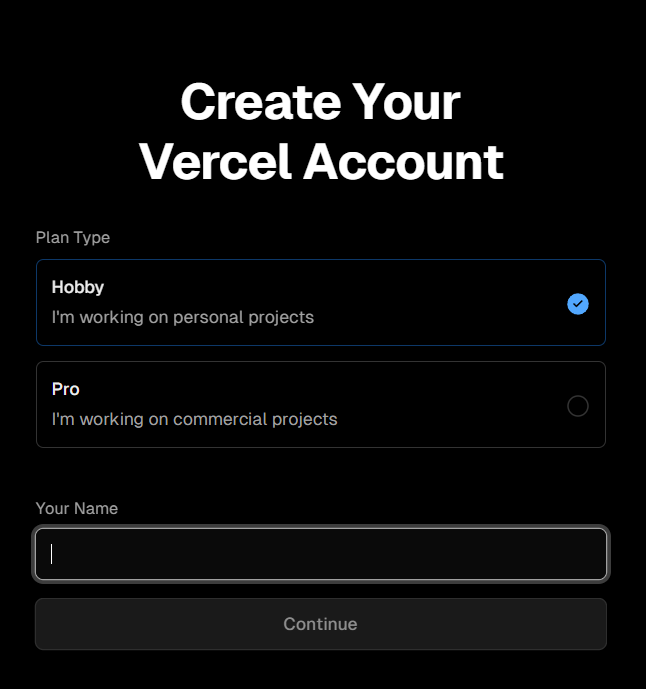
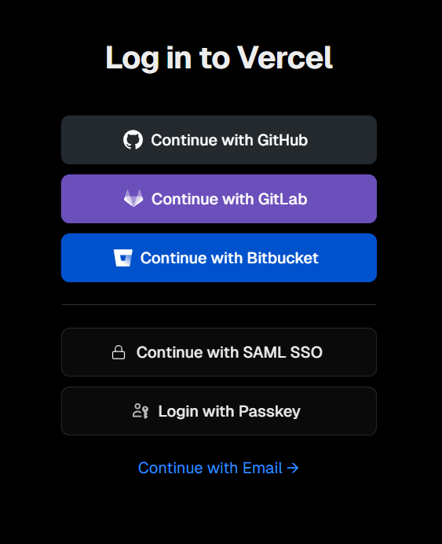
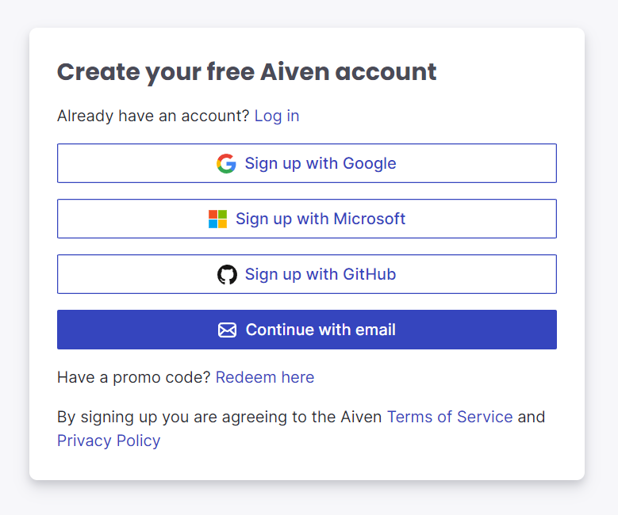
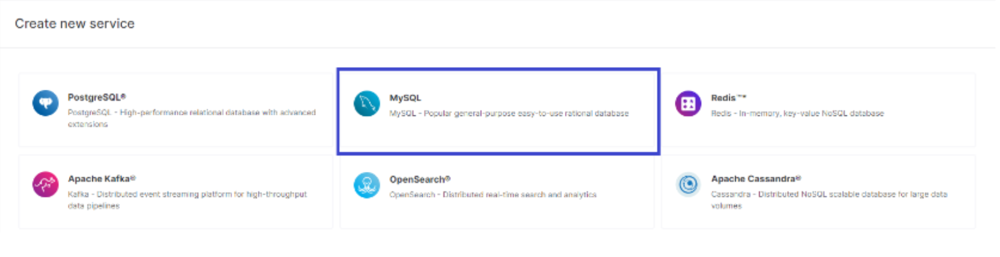
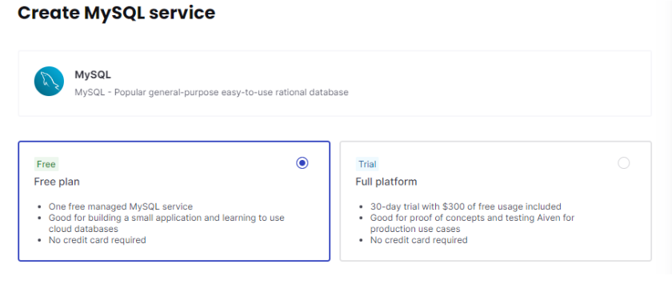
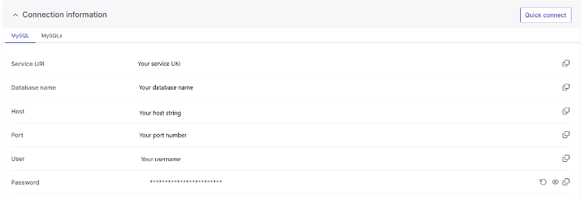

# Hur gör man en Deploy

- [Link to English version](README(EN).md)

### Man ska börja med att skapa konton på Vercel och Aiven

- [Länk till Vercel](https://vercel.com/login)
- [Länk till Aiven](https://aiven.io)

### Vercel

**Tryck på sign up uppe i högra hörnet**


<br>

**Välj hobby och skriv in ditt namn sedan continue**


<br>

**Fortsätt sedan med GitHub**


<br>

**Nu måste man se till att man har ett GitHub repo som man är redo att deploy**
- Först måste du igen ge tillgång till din GitHub.
- När du har en repo och har gett tillgång ska du importa det repot som du vill deploy.
- Nu dags att gå vidare till *Aiven*.


### Aiven

**Tryck på Get started for free uppe i högra hörnet**


<br>

**Här kan vi också fortsätta med GitHub**


<br>

**Sen vill vi välja MySQL**


<br>

**Sen vill vi välja en Free plan**


<br>

**Nu har vi fått all information för att kunna logga in till databasen med adminer**


<br>


### Sista steget innan Deployment

- Först vill vi skapa en mapp i rootmappen som heter **api**. I den mappen vill vi skapa en fil som heter **"index.php"** där vi ska skriva in en kod. Den koden är till för att Vercel ska veta vart applikationen ligger i projektet. **Code:**
```ruby
<?php
// Forward Vercel requests to normal index.php
require __DIR__ . '/../public/index.php';
```
- Sedan vill vi skapa en fil i rootmappen som heter **"vercel.json"**. I den ska vi också lägga in en del kod som är till för att configurera projektet för deployment via Vercel.
**Code:** 

```ruby
{
    "version": 2,
    "framework": null,
    "functions": {
    "api/index.php": { "runtime": "vercel-php@0.6.1" }
    },
    "routes": [{
    "src": "/(.*)",
    "dest": "/api/index.php"
    }],
    "env": {
    "APP_ENV": "production",
    "APP_DEBUG": "true",
    "APP_URL": "https://yourproductionurl.com",
    "APP_CONFIG_CACHE": "/tmp/config.php",
    "APP_EVENTS_CACHE": "/tmp/events.php",
    "APP_PACKAGES_CACHE": "/tmp/packages.php",
    "APP_ROUTES_CACHE": "/tmp/routes.php",
    "APP_SERVICES_CACHE": "/tmp/services.php",
    "VIEW_COMPILED_PATH": "/tmp",
    "CACHE_DRIVER": "array",
    "LOG_CHANNEL": "stderr",
    "SESSION_DRIVER": "cookie"
    }
}
```
- Nu är det ett sista steg vilket är att databas informationen man fick i Aiven ska då läggas in i .env filen i ditt projekt. Så kollar man i Aiven så fick vi Host, Port, User, Password de ska då sättas in i denna del av .env filen.

```ruby
DB_CONNECTION=mysql
DB_HOST= "Host"
DB_PORT= "Port"
DB_DATABASE= 
DB_USERNAME= "User"
DB_PASSWORD= "Password"
```

### Deployment

**Nu är det absolut sista steget**
Sista steget är att pusha dina ändringar till ditt repo. Gå sedan till Vercel och under inställningarna (settings) ange i fältet 'Root' vad din huvudfil heter. Därefter är det bara att trycka på 'Deploy' så är ditt projekt live!

*Det betyder att du måste:*

1. Sista steget är att pusha dina ändringar till ditt repo.
2. Gå sedan till Vercel och under settings.
3. Ange i fältet 'Root' vad din huvudfil heter.
4. Därefter är det bara att trycka på 'Deploy' så är ditt projekt live!


**Nu har du deployed ditt projekt!**